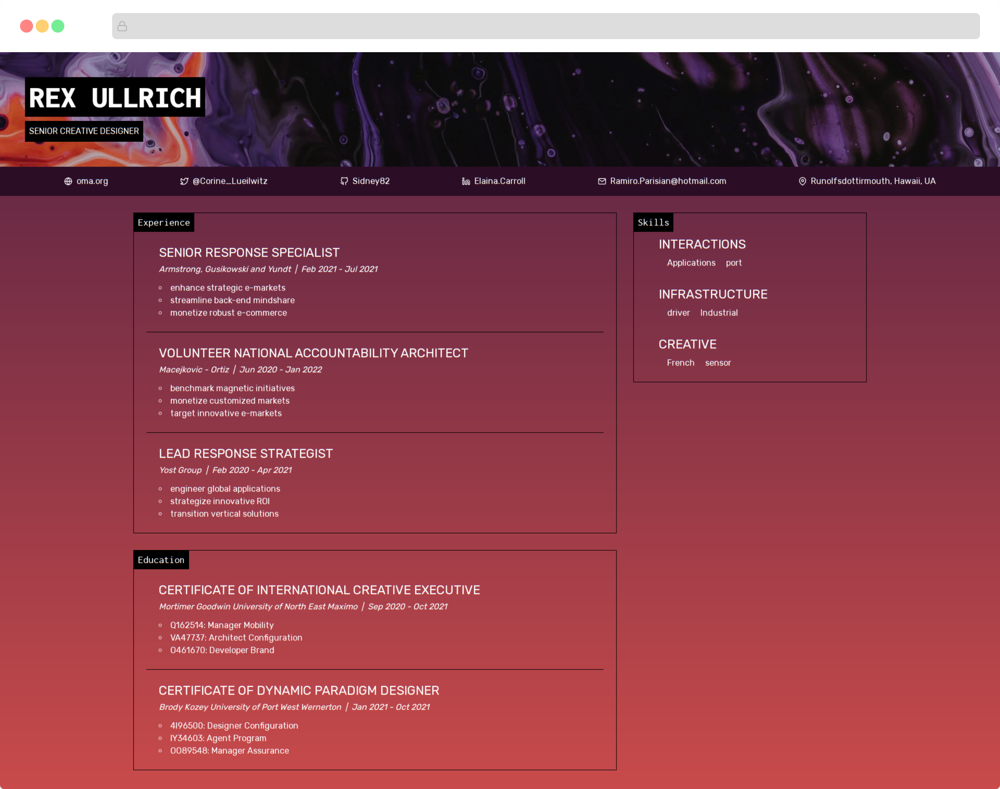
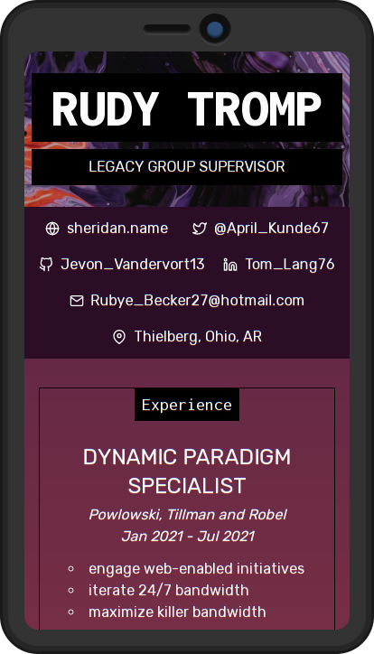

	

  

# "Wait, sort of?"

[Check the wiki for an explanation of what this project DOES and DOES NOT do](https://github.com/k4y4k/web-resume/wiki/%22Wait,-sort-of%3F%22---What-data-this-project-supports).

# Seeing For Yourself

Assuming you're want a resume that just lists:

- your experience (incl. volunteer work),
- your education,
- your skills,
- how to contact you
- (of course) your name

(and you like the colour purple), then you're golden. Feel free to use.

## Step one: Get

You need Node.js, so sort that out first.

Clone this repo (via git, GitHub Desktop, or download as ZIP).

Delete the `.git/` folder.

Run `yarn install` (or `npm install`)

Run `yarn fake` to generate fake data. **!! This is important !!** Without this data, your site won't build.

## Step two: Set

Change the data in `src/data/data.json` to describe you.

You might want to replace `src/images/hero.jpg` as well, but that's on you.

## Step three: Net

Run `yarn build && yarn serve`.

Open the address it gives you in your browser (probably `http://localhost:9000`) and print the page to PDF.

Done!

# Screenshots

⚠️ Any names, addresses, handles, locations, or other data has been generated with faker.js for purely illustrative purposes. No impersonation or endorsement has been intended. ⚠️

